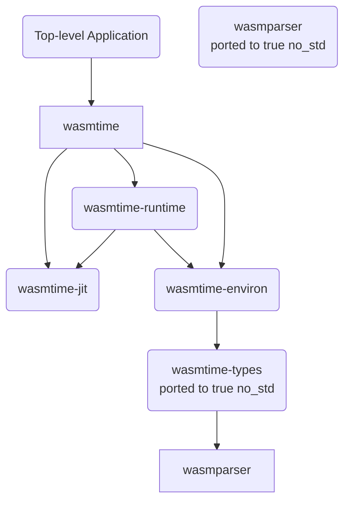

## Bringing `wasmtime` to `no_std`*

🎉🎉 `wasmtime` now builds and runs on Theseus! 🎉🎉

This is the first port of `wasmtime` to a `no_std`* environment, to the best of our knowledge. 
The initial barebones version of `wasmtime` was [completed and successfully run on Theseus on May 17th, 2022](https://github.com/kevinaboos/Theseus/commit/39a647581fdb7f259559400b6222613e3f914916).

This milestone marks the culmination of a very long journey, as evidenced by our previous several posts on this topic 
and the fact that our initial port started with a version of `wasmtime` from mid-October 2021. Yeesh!

In this post, we aim to
1. Provide a high-level description of `wasmtime` and its multi-crate architecture,
2. Enumerate the changes needed to build `wasmtime` on `no_std`*, and
3. Itemize the dependencies/functionality that `wasmtime` requires from the underlying platform.

While we don't intend this to be a porting tutorial, we do hope it makes it easier to port and run `wasmtime` on other platforms in the future. 

> Why is there an asterisk by `no_std`? 
> 
> Theseus doesn't yet support the `std` library, so this is a legitimate `no_std` port.
> However, one cannot simply take this port and run it within any other `no_std` environment,
> because `wasmtime` still relies on basic functionality from the underlying platform.
> 
> We did have to add limited `std`-like components to Theseus in order to support `wasmtime`'s needs;
> we discuss which components were needed in the following sections. 

"C'mon, just skip to the <s>recipe</s> code already!"

No problem, [here is the full changeset to `wasmtime`](https://github.com/theseus-os/wasmtime/compare/35cdd53989b5eaa01691aac915d60cf609776ab6..c05b37c41b363008b9ff84b3493ea6d4f067cf88). 
Note that this doesn't include the many changes and extensions we made to Theseus to support this; those are described in the rest of the article. 

## 1. Summary of `wasmtime`'s key parts

TODO: finish diagram of wasmtime dependencies 

NOTE: this diagram includes only the components of `wasmtime` and its dependencies that *do not already support `no_std`*. 

We took a bottom-up approach to iteratively port lower-level dependencies until they built on Theseus, and then moved on to the next highest layer in the dependency stack. 

By far, the most complex crate to port was `wasmtime-runtime`, which not only has myriad dependencies that each needed porting, but also much platform-specific code that is necessarily unsafe and quite intricate. 

## 3. Functionality needed to fulfill wasmtime's dependencies
* Heap allocation for `alloc` types
  * Sorry, you ain't gonna run `wasmtime` without a heap!
* Stack unwinding for proper panic handling and ensuring drop handlers run
  * `wasmtime-runtime` requires both `catch_unwind` and `resume_unwind`
  * Also need to support registration of external unwind info that comes from WASM modules that were JIT-compiled into native code. This must allow Theseus's (or your platform's) unwinding routine to use it.
* `backtrace` for capturing a stack trace
  * Plus optional symbolication of addresses, i.e., `addr2line` functionality
* memory management: allocating memory regions, creating memory mappings, etc.
  * Uses crates like `libc`, `region`, `rsix` for Unixes
  * We had to slightly modify `wasmtime-runtime`'s structs for memory-mapped WASM modules and files to include an owned Theseus `MappedPages` instance
* Mutual Exclusion
  * We do use THeseus's own sleeping `Mutex` type, but this is also easily provided by crates like `spin`
* signal handling for traps
  * On Theseus, this means handling CPU exceptions
* `object` for object file editing
  * We contributed a PR to `object` that allowed reading _and_ writing of object files in a `no_std` environment
* `bincode` for (de)serialization
  * Just had to upgrade to newer major version that already supported `no_std`
  * Required some minor changes to how `wasmtime` uses bincode, in accordance with [`bincode`'s migration guide](https://github.com/bincode-org/bincode/blob/trunk/docs/migration_guide.md)
* Basic reading of a file
  * Only needed when reading a AOT pre-compiled WASM module from a file for purposes of deserialization
* Tasks or threads
  * Fully preemptive is essentially required, as cooperative multitasking would require a significant rework of `wasmtime`
  * Async/await executors would also be needed if you chose to support that feature of `wasmtime`
* Thread-Local Storage (TLS)
  * See previous post
* `Path`s
* `psm` for portable stack manipulation
  * Only used to obtain the current value of the stack pointer register
* Basic I/O traits
  * Mostly just the basic ones from `std::io`, which are usable in `core` through a variety of `no_std` crates like `core2` (previously `bare_io`), `core_io`, etc.
* `more_asserts` for easy assertions
  * We contributed a PR to make this `no_std`
* Basic error handling via `anyhow` and `thiserror`
  * `anyhow` already supports `no_std`, but has a different API due to its reliance on `std::error::Error`. We had to painstakingly modify every call to `anyhow` with an additional `.map_err(anyhow::Error::msg)` statement.
  * `thiserror` cannot support `no_std` yet, but there are `no_std`-compatible drop-in alternatives like `thiserror_core2` which derive `core2::error::Error` instead
  * Once the `std::error::Error` trait is moved into `core`, all of these pain points will be permanently healed!
* `crc32fast`, a dependency of the `object` crate
  * We contributed a PR to make this compile properly for custom targets
* A source of randomness
  * Easiest course of action is to use `rand`'s `SmallRng` in `no_std`
* Basic I/O, e.g., for printing to `stdout` or a log

### Picking up where we left off
In our [prior post](2022/04/12/wasmtime-progress-update-2.html), we had completed

## Concluding remarks + next steps

